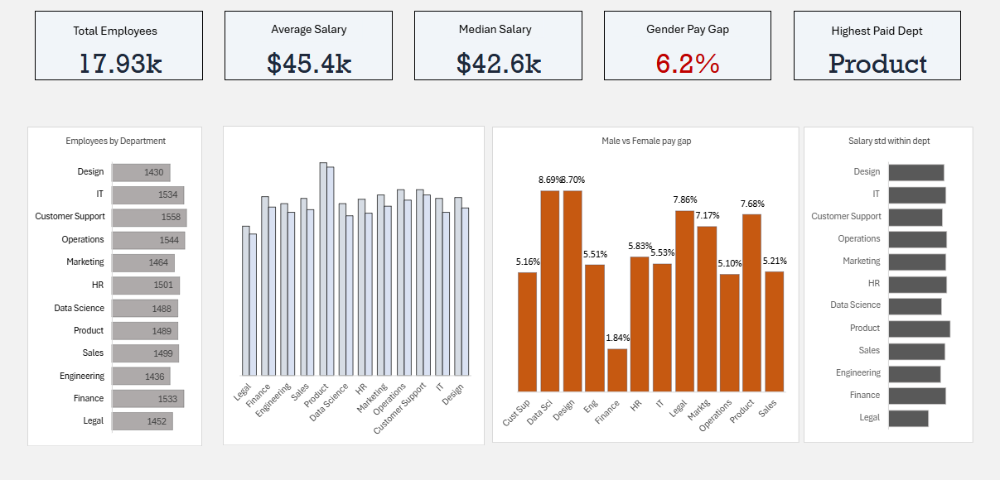
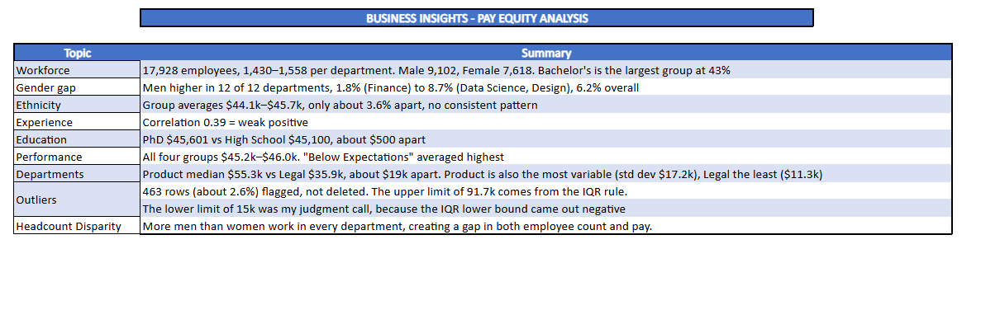

# Employee Pay Equity Analysis (Excel)

An end-to-end Excel project: cleaning a messy, multi-currency HR dataset and testing for pay differences by gender, ethnicity, department, experience, education and performance.

**Business question:** *Are employees paid fairly, and which factors are associated with differences in pay?*



---

## Key Findings

| # | Finding | Evidence |
|---|---|---|
| 1 | **Men earn more than women in all 12 departments** | Gap ranges from 1.8% (Finance) to 8.7% (Data Science, Design); 6.2% overall ($46,709 vs $43,991 average). The gap persisted in the roles tested within job title and experience bracket |
| 2 | **No consistent ethnicity pattern** | Group averages sit within $44.1k to $45.7k (about 3.6% apart) |
| 3 | **Experience, education and performance explain little of pay** | Experience correlation r = 0.39 (weak); PhD vs High School differ by about $500; performance ratings show no clear link to salary |
| 4 | **Product pays most and varies most; Legal pays least and varies least** | Median $52.9k vs $35.8k; standard deviation $17.2k vs $11.3k |
| 5 | **Data quality mattered** | 463 salary rows (2.6%) were broken values and were flagged and excluded from all pay calculations |

> These are *observed differences* in a synthetic dataset. They show where a pay review may be worth doing, not proof of discrimination.



---

## Dataset

- **Source:** Kaggle, *Employee Pay Equity (messy)* (synthetic data). Add link here.
- **Size:** about 96,900 rows, 19 columns. A random sample of **18,000 rows** was used for the analysis.
- **Result after cleaning:** 17,928 employees, 12 departments, 14 countries.

## Workflow

| Step | What was done |
|---|---|
| Audit | Profiled every column for blanks, duplicates, spelling variants and mixed formats |
| Cleaning | Standardised gender, education, work mode, performance rating, country and department; fixed mixed date formats; stripped currency symbols from salaries; removed 72 duplicate records |
| Currency | Converted 12 currencies to USD with an exchange-rate table (approximate rates, October 2026) |
| Missing values | Mean or group average for numeric fields; labelled *Prefer not to say* or *Unknown* for demographic and categorical gaps rather than guessing |
| Outliers | IQR rule for the upper limit (about $91.7k) and a $15k floor; rows flagged, not deleted |
| Features | Tenure, age and experience groups |
| Analysis | Average, median, standard deviation, correlation, gender and ethnicity gap by department, sample-size checks |
| Dashboard | KPI cards and four department charts |

## Excel Skills Used

`IF` / `IFS` / `AND` · `TRIM` / `CLEAN` / `SUBSTITUTE` · `LEFT` / `MID` / `RIGHT` / `FIND` · `DATEVALUE` / `DATE` / `DATEDIF` · `XLOOKUP` · `AVERAGEIFS` / `COUNTIFS` · `MEDIAN` / `STDEV` / `QUARTILE` / `SKEW` / `CORREL` · PivotTables · Charts

Built in Excel for the web.

## Repository Structure

```
├── README.md
├── Project_files/
│   └── employee_pay_equity_messy.csv        # original raw dataset
├── Excel_Pay_Equity_Analysis.xlsx           # full workbook
└── images/
    ├── Dashboard_Overview.png
    └── Business_Insights.png
```

**Workbook sheets:** `RAW_DATA` · `Clean_Data` · `Business_Questions` · `pay_gap_gender` · `pay_gap_ethnicity` · `WORKFORCE` · `COMPENSATION` · `DASHBOARD` · `BUSINESS_INSIGHTS`

## Limitations

- Synthetic data, so findings describe this dataset only.
- Exchange rates are fixed approximations, not historical rates.
- About 859 missing education levels were filled with the most common value (Bachelor's).
- The $15k salary floor is a judgment call, because the IQR lower bound was negative.
- Ambiguous dates such as 12/2/2022 were read as day/month/year.
- The gender gap compares averages and does not prove a cause.

## Next Steps

Rebuild the cleaning and analysis in Python (pandas), then build an interactive dashboard in Tableau or Power BI.

---

**Author:** Arbaz · Data Analyst in training · Excel, Python, Power BI
**LinkedIn:** https://www.linkedin.com/in/sayyadarbaz/