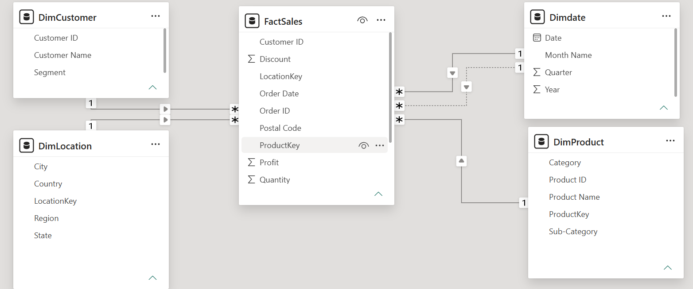
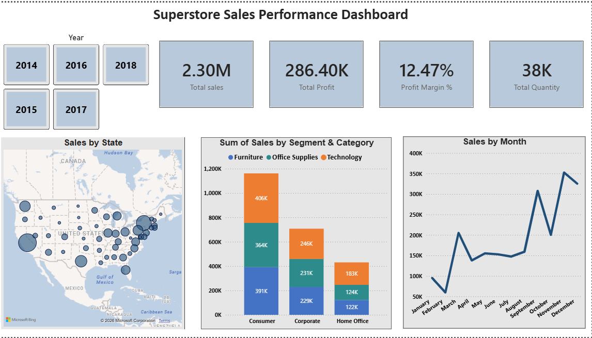
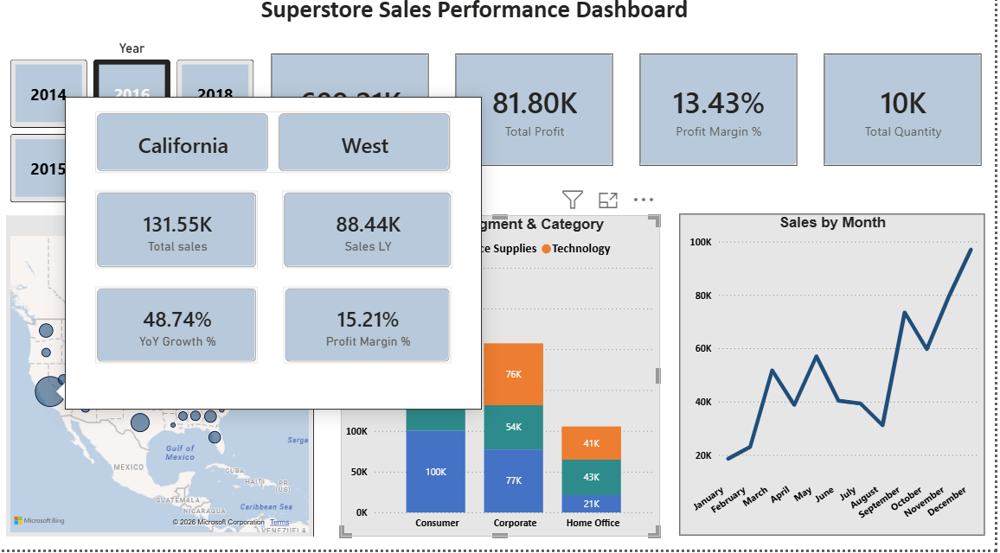

# Superstore Sales Analysis — Power BI

An end-to-end Power BI project built on the Superstore retail dataset, covering data cleaning 
(Power Query/M), enterprise-style data modeling (Star Schema), DAX-based business logic, 
an interactive dashboard, and deployment concepts including Row-Level Security.

## Overview

| | |
|---|---|
| **Dataset** | [Superstore Sales Dataset](https://www.kaggle.com/datasets/vivek468/superstore-dataset-final) (Kaggle) |
| **Size** | 9,994 rows — US retail order data, 2014–2017 |
| **Tools** | Power BI Desktop, Power Query (M), DAX |
| **Status** | ✅ Complete |

## Project Phases

### Phase 1 — ETL (Power Query)
- Diagnosed and fixed a critical data-loss bug: an incorrect CSV `QuoteStyle` setting caused 
  commas inside quoted product names to misalign columns, corrupting and silently dropping 
  ~73% of rows — found through row-count auditing, fixed at the Source step.
- Corrected data types (Date, Text) with locale handling; preserved leading zeros on ZIP codes.
- Built a custom Date dimension table from scratch using `List.Dates()` in M.

### Phase 2 — Data Modeling (Star Schema)
- Modeled a Star Schema: **FactSales** at the center, with **DimDate**, **DimCustomer**, 
  **DimProduct**, and **DimLocation** as dimensions.
- Solved a Many-to-Many relationship on Region/City with a **composite key** 
  (`LocationKey = State & "-" & City`), since city names alone weren't unique across states.
- Implemented a **role-playing dimension**: Order Date active, Ship Date inactive 
  (activated selectively via `USERELATIONSHIP`).

### Phase 3 — DAX
- Core measures: Total Sales, Total Profit, Profit Margin % (`DIVIDE`), Total Quantity.
- Time Intelligence: `SAMEPERIODLASTYEAR`, `TOTALYTD`, YoY Growth % — built using `CALCULATE` 
  and `VAR` for readable, efficient logic.
- `USERELATIONSHIP` used to report on Ship Date without disturbing the default Order Date path.

### Phase 4 — Dashboard (UI/UX)
- Executive Dashboard following an F-pattern layout: KPI row, category breakdown, geographic 
  and monthly trend views.
- Two **custom tooltip pages** surfacing Total Sales, YoY Growth %, and Profit Margin % on hover — 
  designed to match the dashboard's color palette rather than using visual defaults.
- Consistent color coding, rounded axis units, and restrained visual count throughout.

### Phase 5 — Deployment Concepts
- Built and tested a **Row-Level Security (RLS)** role ("West Manager") restricting report 
  data to a single region via a DAX filter on the Location dimension, verified using Power BI's 
  "View As" preview.

## Data Model

## Dashboard

## Key Takeaways

- "Clean-looking" data can hide serious issues (silent parsing errors) that only surface through 
  systematic validation, such as row-count checks before and after transformation.
- A single-column key isn't always unique; composite keys are a practical fix when no natural 
  unique identifier exists.
- Percentage-based growth metrics (MoM, YoY) can be misleading against a small base value — 
  worth pairing with absolute figures or choosing a more stable comparison period.

---
*Part of my [Data Analytics Portfolio](../../).*