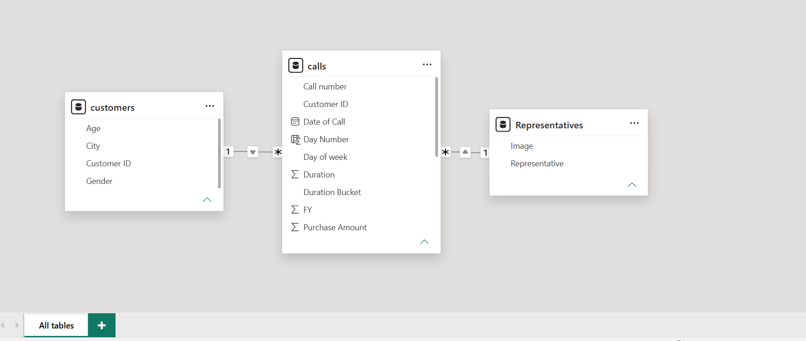
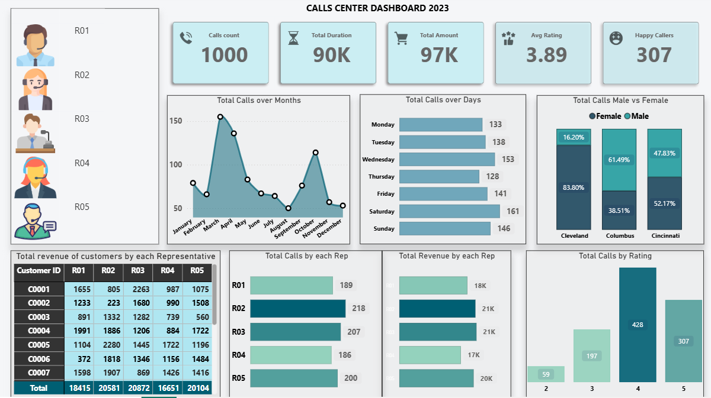

# Calls Center Dashboard 2023 — Power BI

An interactive call-center performance dashboard analyzing 1,000 customer calls across representatives, cities, and time, with a custom click-to-filter representative panel.

## Overview

| | |
|---|---|
| **Tool** | Power BI Desktop |
| **Data Model** | 3 related tables — `calls`, `customers`, `Representatives` |
| **Status** | ✅ Complete |

## Data Model

*Relationships between `calls`, `customers`, and `Representatives` tables.*

## Dashboard

## Features
- KPI row: Calls Count, Total Duration, Total Amount, Avg Rating, Happy Callers
- Monthly call volume trend and day-of-week breakdown
- City × gender caller distribution
- Revenue and call volume by representative
- Custom image-based filter panel — click a representative's photo to filter the entire dashboard
- Rating distribution (1–5) across all calls

## Key Insights
- **Cleveland callers are 84% male, while Columbus is 61% female** — a notable city-level skew worth checking against the local customer base or marketing channel mix.
- **R02 leads both call volume (218) and revenue (21K)** among representatives — worth reviewing their approach as a potential best practice for the team.
- **Most calls rate 4/5 (428 calls)**, with very few at the lowest rating (2/5, 59 calls) — overall service quality trends positive.

## Skills Demonstrated
- Relational data modeling across multiple tables
- DAX measures for KPI calculation
- Custom interactive filtering using image-based slicers
- Dashboard UX: consistent color system, KPI-first layout

---
*Part of my [Data Analytics Portfolio](../../).*